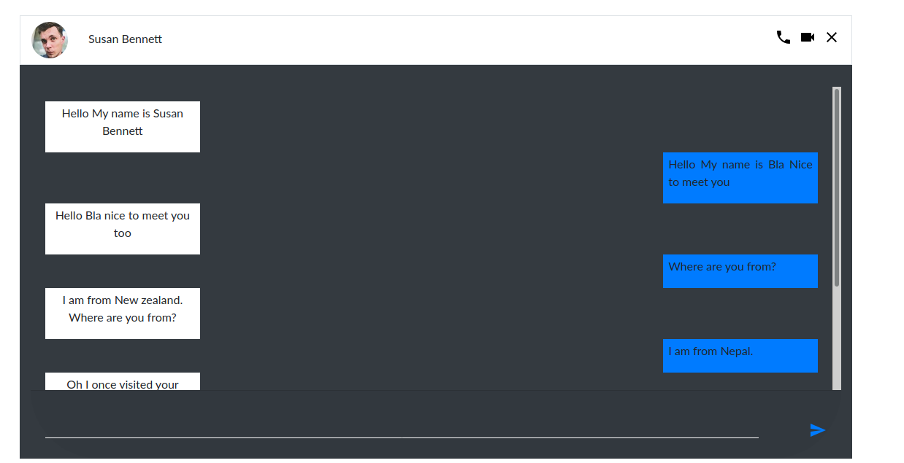

# Introduction
**Bootstrap Theme For Lazy developers**


### Installation
Make sure you have sass installed
```
git clone https://github.com/dibashthapa/Bootstrap-theme.git
cd Bootstrap-theme

```

**Bootstrap Themes**
<table>
<tr>
<th> SN </th>
<th> Theme </th>
<th> Description</th>
<th> Responsive </th>
<th> URL </th>
</tr>

<tr>
<td> 1 </td>
<td> School Page </td>
<td> Landing Page for the School Website..</td>
<td> No </td>
<td> pending </td>
</tr>

<tr>
<td> 2 </td>
<td> Online Chat </td>
<td> Interface of Online Chat application between two users. </td>
<td> Yes </td>
<td> pending </td>
</tr>

<tr>
<td> 3 </td>
<td> Form </td>
<td> Interface of Login Form</td>
<td> No </td>
<td> pending </td>
</tr>
</table>


##### Theme Usage
For eg. School Page


```
cd 'School Page'
```
Open **index.html** in your browser


##### Screenshots
---
**Online Chat**


--------

**Form**


--------

**School Page**


-------

#### Customization
Customization of these themes are easy. They are created with the help of sass. You can choose any theme and modify any Bootstrap variables as you like. I assume you already have the knowledge of **SASS** and **Bootstrap**. <br>

 All the Bootstrap variables are stored in
 ```
boostrap/scss/_variables.scss
 ```

All you have to do is change the default variables  in **scss/style.scss** before importing

```
$varible_name = value
@import .....
```
Well you did change the variable but the styles won't take effects until you compile the scss file
```
scss --watch scss/style.scss css/style.css
```
#### Contribution
-----

#### How to contribute ?
*Copy your favorite template from the internet. Don't download all the static files and post here. Open up your favorite editor and create your own theme by looking other's theme and Submit your pull requests*
